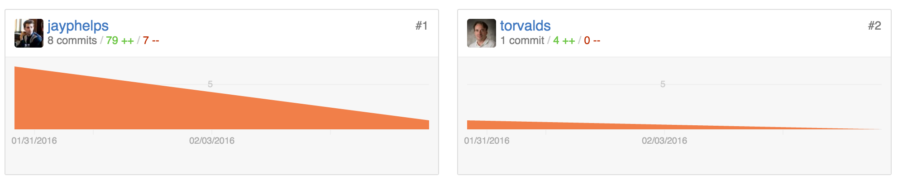

# git-blame-someone-else

> "I love git-blame-someone-else!!" -[Linus Torvalds says](https://github.com/jayphelps/git-blame-someone-else/commit/e5cfe4bb2190a2ae406d5f0b8f49c32ac0f01cd7)*

## Install

```bash
$ git clone https://github.com/jayphelps/git-blame-someone-else.git
$ cd git-blame-someone-else
$ sudo make install
```

## Usage

```bash
$ git blame-someone-else <author> <commit>
```



## Disclaimer:

This changes not only who authored the commit but the listed commiter as well. It also is something I wrote as a joke, so please don't run this against your production repo and complain if this script deletes everything.

*Linus Torvalds didn't really approve of this. It's a joke to prove it works. [See his fake commit here](https://github.com/jayphelps/git-blame-someone-else/commit/e5cfe4bb2190a2ae406d5f0b8f49c32ac0f01cd7)
